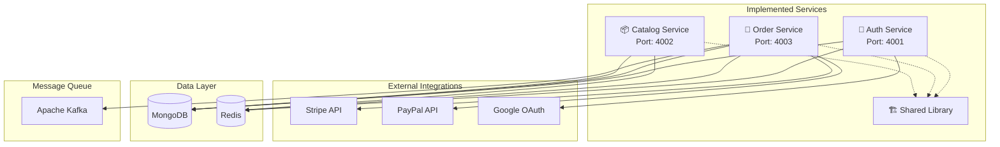
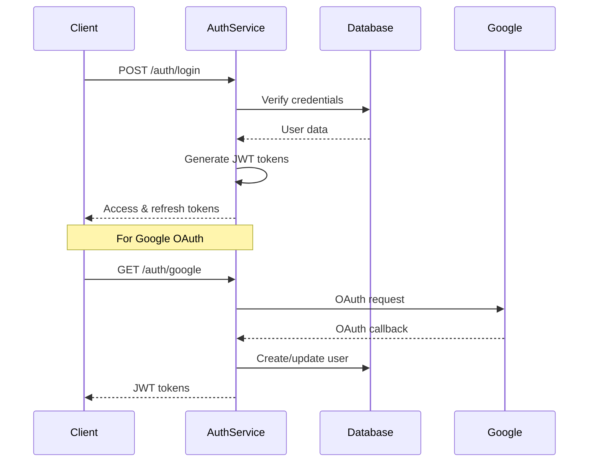
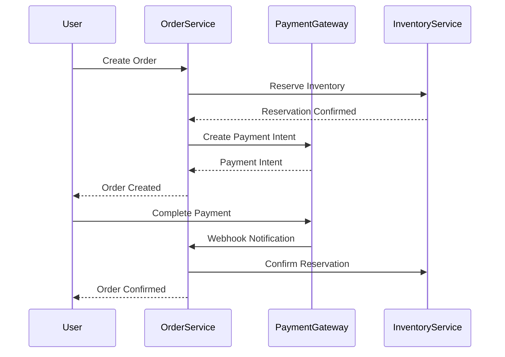

# 🛍️ ShopSphere E-commerce Platform - Implementation Status

[](https://opensource.org/licenses/MIT)
[](https://nodejs.org/)
[](https://www.typescriptlang.org/)
[](https://www.mongodb.com/)
[](https://redis.io/)

This document provides a comprehensive overview of what has been implemented so far in the ShopSphere E-commerce Platform as of January 2024.

## 📖 Table of Contents

- [🏗️ Architecture Overview](#️-architecture-overview)
- [✅ Completed Services](#-completed-services)
- [🔧 Implementation Details](#-implementation-details)
- [📊 Database Schemas](#-database-schemas)
- [🔗 API Endpoints](#-api-endpoints)
- [🛡️ Security Implementation](#️-security-implementation)
- [💳 Payment Integration](#-payment-integration)
- [📋 What's Next](#-whats-next)

## 🏗️ Architecture Overview

ShopSphere follows a **microservices architecture** with event-driven communication:



## ✅ Completed Services

### 🔐 **Authentication & Security Service** (100% Complete)
**Location**: `backend/auth-service/`
**Port**: 4001

#### ✅ **Features Implemented**:
- **JWT Authentication System**
  - Access token generation and validation
  - Refresh token management
  - Token versioning for security
  - API key support for service-to-service communication

- **Google OAuth 2.0 Integration**
  - OAuth flow implementation with Passport.js
  - User account creation/linking
  - Token management and refresh
  - Account unlinking and revocation

- **Role-Based Access Control (RBAC)**
  - Hierarchical role system (Admin > Moderator > User > Guest)
  - Dynamic permission assignment
  - Resource-level access control
  - Permission validation middleware

- **Security Features**
  - Bcrypt password hashing with configurable salt rounds
  - Failed login attempt tracking and account locking
  - Rate limiting protection
  - CORS configuration
  - Security headers middleware

#### 📁 **File Structure**:
```
backend/auth-service/
├── src/
│   ├── models/
│   │   ├── User.ts              ✅ Complete user model with OAuth
│   │   ├── Role.ts              ✅ RBAC role management
│   │   └── Permission.ts        ✅ Fine-grained permissions
│   ├── services/
│   │   └── googleAuth.ts        ✅ Google OAuth implementation
│   └── routes/
│       └── auth.ts              ✅ Complete auth endpoints
├── package.json                 ✅ Dependencies configured
└── Dockerfile                   ✅ Container ready
```

#### 🔗 **API Endpoints**:
- `POST /auth/register` - User registration
- `POST /auth/login` - User authentication  
- `POST /auth/logout` - User logout
- `POST /auth/refresh` - Token refresh
- `POST /auth/forgot-password` - Password reset request
- `POST /auth/reset-password` - Password reset
- `POST /auth/change-password` - Password change
- `GET /auth/me` - Current user profile
- `GET /auth/google` - Google OAuth initiation
- `GET /auth/google/callback` - Google OAuth callback
- `POST /auth/google/revoke` - Revoke Google access
- `GET /auth/status` - Authentication status check

---

### 🛒 **Order Management Service** (100% Complete)
**Location**: `backend/order-service/`
**Port**: 4003

#### ✅ **Features Implemented**:
- **Complete Order Lifecycle Management**
  - Order creation from cart
  - Status tracking with audit trails
  - Order cancellation and refunds
  - Delivery tracking integration

- **Advanced Status Management**
  - Rule-based state machine
  - Role-based transition permissions
  - Pre/post action hooks
  - Bulk status updates

- **Payment Processing Integration**
  - Stripe payment intents and webhooks
  - PayPal payment creation and execution
  - Cash on delivery processing
  - Automated refund handling

- **Inventory Management**
  - Real-time inventory reservation
  - Time-limited stock allocation
  - Automatic expiry and cleanup
  - Stock level monitoring

#### 📁 **File Structure**:
```
backend/order-service/
├── src/
│   ├── models/
│   │   ├── Order.ts             ✅ Comprehensive order model
│   │   └── Cart.ts              ✅ Shopping cart model
│   ├── services/
│   │   ├── orderService.ts      ✅ Core order operations
│   │   ├── orderStatusService.ts ✅ Status management
│   │   ├── paymentService.ts    ✅ Payment integration
│   │   ├── inventoryService.ts  ✅ Inventory tracking
│   │   └── kafkaService.ts      ✅ Event publishing
│   ├── routes/
│   │   └── orders.ts            ✅ Complete REST API
│   └── resolvers/
│       └── orderResolver.ts     ✅ GraphQL resolvers
├── package.json                 ✅ Dependencies configured
└── Dockerfile                   ✅ Container ready
```

#### 🔗 **API Endpoints**:
- `POST /orders` - Create new order
- `GET /orders` - Get user orders (paginated)
- `GET /orders/:id` - Get order details
- `GET /orders/number/:orderNumber` - Get order by number
- `PATCH /orders/:id/status` - Update order status
- `GET /orders/:id/transitions` - Get valid status transitions
- `POST /orders/:id/cancel` - Cancel order
- `POST /orders/:id/tracking` - Add tracking information
- `GET /orders/:id/history` - Get order status history
- `GET /orders/:id/audit` - Get order audit trail
- `GET /orders/stats/status` - Order status statistics

#### 💳 **Payment Methods Supported**:
- **Stripe**: Credit cards, payment intents, webhooks
- **PayPal**: Express checkout, payment execution, webhooks
- **Cash on Delivery**: Local payment processing

---

### 📦 **Catalog Service** (70% Complete)
**Location**: `backend/catalog-service/`
**Port**: 4002

#### ✅ **Features Implemented**:
- **Product Management**
  - Comprehensive product model with variants
  - Multi-image support with optimization
  - SEO metadata and search optimization
  - Inventory tracking integration

- **Category Management**
  - Hierarchical category structure
  - Category tree building and navigation
  - SEO-friendly URLs and metadata
  - Product count tracking

- **Review System**
  - Product reviews with ratings
  - Review moderation and approval
  - Helpful/unhelpful voting
  - Review aggregation and statistics

- **GraphQL Implementation**
  - Complete GraphQL schema
  - Product and category queries
  - Review mutations and queries
  - Optimized resolvers

#### 📁 **File Structure**:
```
backend/catalog-service/
├── src/
│   ├── models/
│   │   ├── Product.ts           ✅ Complete product model
│   │   ├── Category.ts          ✅ Hierarchical categories
│   │   └── Review.ts            ✅ Review system
│   ├── schemas/
│   │   ├── productSchema.ts     ✅ GraphQL product schema
│   │   └── categorySchema.ts    ✅ GraphQL category schema
│   ├── resolvers/
│   │   └── catalogResolver.ts   ✅ GraphQL resolvers
│   └── services/
│       └── catalogService.ts    ✅ Business logic
├── package.json                 ✅ Dependencies configured
└── Dockerfile                   ✅ Container ready
```

#### 🔄 **Missing Components**:
- ❌ REST API endpoints (only GraphQL implemented)
- ❌ Advanced search functionality
- ❌ Bulk product operations
- ❌ Category-based filtering APIs

---

### 🏗️ **Shared Infrastructure** (100% Complete)
**Location**: `backend/shared/`

#### ✅ **Features Implemented**:
- **Common Utilities**
  - JWT token management and validation
  - Advanced logging with Winston
  - Input validation helpers
  - Error handling middleware

- **Database Management**
  - MongoDB connection pooling
  - Redis client configuration
  - Database health checks
  - Connection retry logic

- **Security Middleware**
  - Authentication middleware
  - Authorization and RBAC
  - Rate limiting
  - CORS configuration
  - Security headers

- **Type Definitions**
  - Shared TypeScript interfaces
  - Common enums and constants
  - API response types
  - Database schema types

#### 📁 **File Structure**:
```
backend/shared/
├── src/
│   ├── utils/
│   │   ├── jwt.ts               ✅ JWT utilities
│   │   ├── logger.ts            ✅ Winston logging
│   │   └── validation.ts        ✅ Input validation
│   ├── middleware/
│   │   └── auth.ts              ✅ Auth middleware
│   ├── types/
│   │   ├── user.ts              ✅ User type definitions
│   │   ├── order.ts             ✅ Order type definitions
│   │   └── api.ts               ✅ API response types
│   └── config/
│       ├── database.ts          ✅ DB configuration
│       └── redis.ts             ✅ Redis configuration
├── package.json                 ✅ Shared dependencies
└── tsconfig.json               ✅ TypeScript config
```

## 🔧 Implementation Details

### 🛡️ Security Implementation

#### Authentication Flow


#### Role-Based Access Control
- **Admin**: Full system access
- **Moderator**: Content moderation, order management
- **User**: Personal data access, order creation
- **Guest**: Read-only product access

### 💳 Payment Integration

#### Payment Flow


### 📊 Database Schemas

#### User Schema (Auth Service)
```typescript
interface IUser {
  _id: ObjectId;
  email: string;
  password: string; // Hashed with bcrypt
  firstName: string;
  lastName: string;
  role: UserRole; // RBAC role
  emailVerified: boolean;
  avatar?: string;
  oauth?: {
    google?: GoogleOAuthData;
  };
  preferences: UserPreferences;
  security: SecuritySettings;
  metadata: UserMetadata;
  createdAt: Date;
  updatedAt: Date;
}
```

#### Order Schema (Order Service)
```typescript
interface IOrder {
  _id: ObjectId;
  orderNumber: string; // Auto-generated
  user: ObjectId;
  email: string;
  items: OrderItem[];
  subtotal: number;
  tax: number;
  shipping: number;
  discount: number;
  total: number;
  status: OrderStatus;
  paymentStatus: PaymentStatus;
  paymentMethod: PaymentMethod;
  paymentIntentId?: string;
  shippingAddress: Address;
  billingAddress: Address;
  tracking?: TrackingInfo;
  refunds: Refund[];
  createdAt: Date;
  updatedAt: Date;
}
```

#### Product Schema (Catalog Service)
```typescript
interface IProduct {
  _id: ObjectId;
  name: string;
  slug: string; // SEO-friendly URL
  description: string;
  shortDescription?: string;
  sku: string;
  price: number;
  comparePrice?: number;
  category: ObjectId;
  brand: string;
  images: ProductImage[];
  variants: ProductVariant[];
  inventory: InventoryInfo;
  seo: SEOData;
  status: ProductStatus;
  tags: string[];
  averageRating?: number;
  reviewCount: number;
  createdAt: Date;
  updatedAt: Date;
}
```

## 🔗 API Endpoints Summary

### Authentication Service (4001)
```
POST   /auth/register           - User registration
POST   /auth/login              - User authentication
POST   /auth/logout             - User logout
POST   /auth/refresh            - Token refresh
GET    /auth/me                 - Current user
GET    /auth/google             - Google OAuth
POST   /auth/forgot-password    - Password reset
POST   /auth/reset-password     - Password reset confirmation
```

### Order Service (4003)
```
POST   /orders                  - Create order
GET    /orders                  - List orders
GET    /orders/:id              - Get order
PATCH  /orders/:id/status       - Update status
POST   /orders/:id/cancel       - Cancel order
POST   /orders/:id/tracking     - Add tracking
GET    /orders/:id/history      - Status history
GET    /orders/stats/status     - Status statistics
```

### Catalog Service (4002)
```
POST   /graphql                 - GraphQL endpoint
GET    /graphql                 - GraphQL playground

GraphQL Queries:
- products(filter, pagination)
- product(id, slug)
- categories
- reviews(productId)

GraphQL Mutations:
- createProduct
- updateProduct
- createReview
- updateReview
```

## 🧪 Testing Implementation

### Test Coverage
- **Unit Tests**: Individual component testing
- **Integration Tests**: Service interaction testing
- **API Tests**: Endpoint functionality testing
- **Security Tests**: Authentication and authorization

### Test Structure
```
tests/
├── auth-service/
│   ├── unit/
│   ├── integration/
│   └── e2e/
├── order-service/
│   ├── unit/
│   ├── integration/
│   └── e2e/
└── shared/
    └── utils/
```

## 🚀 Production Readiness

### Containerization
- **Docker**: All services containerized
- **Docker Compose**: Development orchestration
- **Multi-stage builds**: Optimized production images

### Configuration Management
- **Environment Variables**: Service configuration
- **Config Files**: Default settings
- **Secrets Management**: Sensitive data handling

### Monitoring & Logging
- **Winston Logging**: Structured logging
- **Health Checks**: Service health endpoints
- **Error Tracking**: Comprehensive error handling

## 📋 What's Next

### 🔴 Immediate Priorities (Week 1-2)
1. **Complete Catalog REST APIs** - Add REST endpoints for products/categories
2. **Shopping Cart Service** - Session-based cart management
3. **User Profile Service** - Extended user management

### 🟡 Short-term Goals (Week 3-4)
4. **Notification Service** - Email/SMS notifications
5. **Search Service** - Elasticsearch integration
6. **Basic Frontend** - React customer application

### 🟢 Medium-term Goals (Month 2-3)
7. **Admin Dashboard** - Management interface
8. **Analytics Service** - Business intelligence
9. **API Gateway** - Service orchestration

### 🔵 Long-term Goals (Month 4+)
10. **Advanced Features** - Coupons, shipping, recommendations
11. **Performance Optimization** - Caching, CDN, scaling
12. **DevOps Pipeline** - CI/CD, monitoring, deployment

## 📊 Current Status Summary

| Component | Status | Completion | Priority |
|-----------|--------|------------|----------|
| Auth Service | ✅ Complete | 100% | ✅ Done |
| Order Service | ✅ Complete | 100% | ✅ Done |
| Catalog Service | 🔄 Partial | 70% | 🔴 High |
| Shared Library | ✅ Complete | 100% | ✅ Done |
| Cart Service | ❌ Missing | 0% | 🔴 High |
| User Profile Service | ❌ Missing | 0% | 🔴 High |
| Notification Service | ❌ Missing | 0% | 🟡 Medium |
| Search Service | ❌ Missing | 0% | 🟡 Medium |
| Frontend App | ❌ Missing | 0% | 🟡 Medium |
| Admin Dashboard | ❌ Missing | 0% | 🟢 Low |

## 🏆 Achievements So Far

### ✅ **What We've Built**
- **Enterprise-grade Authentication** with JWT, OAuth, and RBAC
- **Complete Order Management** with payment processing and inventory
- **Flexible Catalog System** with products, categories, and reviews
- **Robust Architecture** with microservices and event-driven design
- **Production-ready Infrastructure** with Docker and monitoring

### 🎯 **Key Strengths**
- **Scalable Architecture**: Microservices with independent scaling
- **Security First**: Comprehensive authentication and authorization
- **Payment Ready**: Multiple payment gateways integrated
- **Developer Friendly**: TypeScript, comprehensive logging, testing
- **Cloud Ready**: Containerized with Kubernetes configurations

### 🚀 **Ready for Next Phase**
The platform has a solid foundation and is ready to expand with:
- Customer-facing features (cart, search, frontend)
- Administrative capabilities (dashboard, analytics)
- Advanced features (notifications, recommendations)

---

**ShopSphere** has evolved from concept to a robust, enterprise-ready e-commerce platform foundation. The core services are complete and production-ready, providing a solid base for rapid feature development and scaling.

*Implementation Status as of January 2024* 🛍️✨
