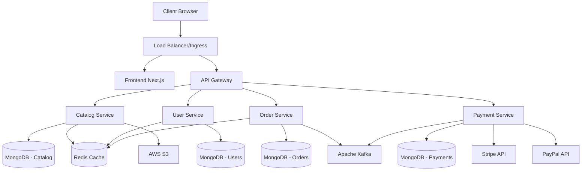

# 🛍️ ShopSphere - Full-Stack E-Commerce Platform

[](https://opensource.org/licenses/MIT)
[](https://nodejs.org/)
[](https://www.typescriptlang.org/)
[](https://nextjs.org/)

A modern, scalable e-commerce platform built with cutting-edge technologies including **Next.js**, **Node.js microservices**, **GraphQL**, **MongoDB**, **Redis**, **Kafka**, **Docker**, and **Kubernetes**.

## 🚀 Features

### Frontend
- ⚡ **Next.js 15** with App Router and Server Components
- 🎨 **Tailwind CSS** for responsive design
- 🔐 **NextAuth.js** for authentication
- 🛒 **Real-time cart management** with Zustand
- 💳 **Stripe & PayPal** payment integration
- 📱 **Mobile-first responsive design**
- 🔍 **Advanced product search and filtering**
- ⭐ **Product reviews and ratings**
- 📊 **User dashboard and order tracking**

### Backend Architecture
- 🏗️ **Microservices architecture** with API Gateway
- 📊 **GraphQL APIs** with Apollo Server
- 🗄️ **MongoDB** for data persistence
- ⚡ **Redis** for caching and session management
- 📨 **Apache Kafka** for event streaming
- 🔒 **JWT authentication** with refresh tokens
- 🌐 **CORS** and security middleware
- 📈 **Rate limiting** and request validation

### Infrastructure
- 🐳 **Docker** containers for all services
- ☸️ **Kubernetes** deployment configurations
- 🌩️ **AWS integration** (S3, CloudFront)
- 🔄 **CI/CD** with GitHub Actions
- 📊 **Monitoring** and logging setup
- 🔧 **Environment-based configuration**

## 🏗️ System Architecture



## 📋 Prerequisites

- **Node.js** >= 18.0.0
- **npm** >= 8.0.0
- **Docker** >= 20.0.0
- **Docker Compose** >= 2.0.0
- **Kubernetes** (optional, for production)

## 🚀 Quick Start

### 1. Clone the Repository

```bash
git clone https://github.com/your-username/shopsphere-ecommerce.git
cd shopsphere-ecommerce
```

### 2. Environment Configuration

```bash
# Copy environment template
cp .env.example .env

# Edit the .env file with your configuration
# Update database URLs, API keys, and service configurations
```

### 3. Install Dependencies

```bash
# Install all workspace dependencies
npm install

# Or install dependencies for individual services
npm install --workspace=frontend
npm install --workspace=backend/catalog-service
```

### 4. Development with Docker

```bash
# Start all services with Docker Compose
npm run docker:up

# Or manually:
docker-compose -f infrastructure/docker/docker-compose.yml up -d

# View logs
docker-compose -f infrastructure/docker/docker-compose.yml logs -f
```

### 5. Local Development

```bash
# Start all services in development mode
npm run dev

# Or start individual services
npm run dev:frontend
npm run dev:backend
```

## 🎯 Service Endpoints

| Service | Port | URL | Description |
|---------|------|-----|-------------|
| Frontend | 3000 | http://localhost:3000 | Next.js application |
| API Gateway | 4000 | http://localhost:4000 | GraphQL gateway |
| Catalog Service | 4001 | http://localhost:4001 | Product catalog API |
| User Service | 4002 | http://localhost:4002 | User management API |
| Order Service | 4003 | http://localhost:4003 | Order processing API |
| Payment Service | 4004 | http://localhost:4004 | Payment processing API |

## 📊 Database Schema

### Catalog Service
- **Products**: Product information, pricing, inventory
- **Categories**: Product categorization
- **Reviews**: Customer reviews and ratings

### User Service
- **Users**: User authentication and basic info
- **Profiles**: Extended user profiles
- **Wishlists**: User wishlists and favorites

### Order Service
- **Orders**: Order information and status
- **Carts**: Shopping cart data
- **Order Items**: Individual order line items

### Payment Service
- **Payments**: Payment transaction records
- **Payment Methods**: Saved payment methods
- **Transactions**: Detailed transaction logs

## 🔧 Configuration

### Environment Variables

Key environment variables (see `.env.example` for complete list):

```bash
# Database
MONGODB_URI=mongodb://localhost:27017
REDIS_URL=redis://localhost:6379

# Authentication
JWT_SECRET=your-jwt-secret
GOOGLE_CLIENT_ID=your-google-client-id

# Payments
STRIPE_SECRET_KEY=sk_test_your-stripe-key
PAYPAL_CLIENT_ID=your-paypal-client-id

# AWS
AWS_ACCESS_KEY_ID=your-aws-access-key
S3_BUCKET_NAME=your-s3-bucket
```

### Service Configuration

Each microservice can be configured independently through environment variables and configuration files in the `config/` directory.

## 🚀 Deployment

### Docker Deployment

```bash
# Build all images
npm run docker:build

# Deploy with Docker Compose
npm run docker:up
```

### Kubernetes Deployment

```bash
# Apply Kubernetes manifests
npm run k8s:deploy

# Or manually:
kubectl apply -f infrastructure/k8s/
```

### Production Deployment

1. **Build and push Docker images**:
   ```bash
   docker build -t your-registry/shopsphere-frontend:latest frontend/
   docker push your-registry/shopsphere-frontend:latest
   ```

2. **Configure production environment**:
   - Update Kubernetes secrets
   - Configure ingress and SSL certificates
   - Set up monitoring and logging

3. **Deploy to Kubernetes**:
   ```bash
   kubectl apply -f infrastructure/k8s/
   ```

## 🧪 Testing

```bash
# Run all tests
npm test

# Run tests for specific service
npm test --workspace=frontend
npm test --workspace=backend/catalog-service

# Run tests in watch mode
npm run test:watch
```

## 📈 Monitoring & Logging

- **Application logs**: Structured JSON logging with Winston
- **Metrics**: Custom metrics for business logic
- **Health checks**: Kubernetes liveness and readiness probes
- **APM**: New Relic integration (configure with `NEW_RELIC_LICENSE_KEY`)

## 🔒 Security Features

- **JWT Authentication** with refresh tokens
- **Rate limiting** on all endpoints
- **CORS protection** with configurable origins
- **Helmet.js** for security headers
- **Input validation** with Joi schemas
- **Encrypted sensitive data** in database
- **Secure cookie settings** for sessions

## 🤝 Contributing

1. Fork the repository
2. Create a feature branch (`git checkout -b feature/amazing-feature`)
3. Commit your changes (`git commit -m 'Add amazing feature'`)
4. Push to the branch (`git push origin feature/amazing-feature`)
5. Open a Pull Request

## 📚 API Documentation

### GraphQL Playground
Access the GraphQL playground at:
- Development: http://localhost:4000/graphql
- Production: https://api.shopsphere.com/graphql

### Key GraphQL Operations

```graphql
# Get products
query GetProducts($limit: Int, $category: String) {
  products(limit: $limit, category: $category) {
    id
    name
    description
    price
    images
    category
    rating
  }
}

# Create order
mutation CreateOrder($input: CreateOrderInput!) {
  createOrder(input: $input) {
    id
    status
    total
    items {
      productId
      quantity
      price
    }
  }
}
```

## 🛠️ Development Workflow

### Adding a New Feature

1. **Plan the feature**: Define requirements and design
2. **Create branch**: `git checkout -b feature/feature-name`
3. **Develop**: Write code following project conventions
4. **Test**: Add unit and integration tests
5. **Document**: Update README and API documentation
6. **Review**: Submit pull request for code review
7. **Deploy**: Merge and deploy to staging/production

### Code Style

- **ESLint** and **Prettier** for code formatting
- **Conventional Commits** for commit messages
- **TypeScript** for type safety
- **Modular architecture** with clear separation of concerns

## 📞 Support

- 📧 Email: support@shopsphere.com
- 💬 Discord: [Join our community](https://discord.gg/shopsphere)
- 📖 Documentation: [Full documentation](https://docs.shopsphere.com)
- 🐛 Issues: [GitHub Issues](https://github.com/your-username/shopsphere-ecommerce/issues)

## 📄 License

This project is licensed under the MIT License - see the [LICENSE](LICENSE) file for details.

## 🙏 Acknowledgments

- **Next.js team** for the amazing React framework
- **Apollo GraphQL** for excellent GraphQL tools
- **MongoDB** for flexible document storage
- **Stripe** for secure payment processing
- **Open source community** for all the fantastic tools and libraries

---

<div align="center">
  <h3>Built with ❤️ for the modern web</h3>
  <p>⭐ Star this repo if you find it helpful!</p>
</div>
